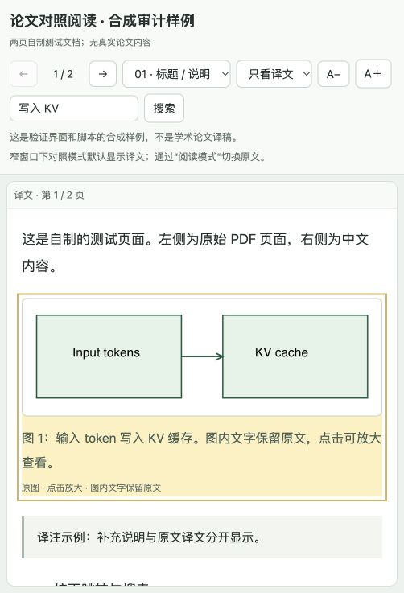

# Paper Translate Reader

Read a paper in Chinese, with the original pages and figures alongside it.

<br clear="left" />

[简体中文](README.md) · **English**

A paper-reading skill for Codex. Give the agent a PDF; it reads the paper, translates it page by page, and builds a self-contained HTML reader. Original PDF pages appear on the left, with the corresponding Chinese text and original figures on the right.

## Reading experience

- **Page-aligned views**: keep the original context, or switch to translation-only or original-only mode.
- **Figures beside the translation**: crop complete figures, preserve their internal text, and add translated captions. Click to enlarge.
- **Reading controls**: page navigation, translation search and highlighting, font-size controls, and a narrow-window layout.
- **One-file output**: pages, text, and images are embedded in HTML. Once generated, the reader needs no server or network connection.
- **Traceable assets**: source PDF fingerprints and crop rectangles help validate page placement, image provenance, and file paths.



*The screenshot uses a synthetic test document. Download the [demo HTML](examples/demo.html) and open it in a browser; GitHub's file view displays the HTML source.*

## Getting started

### Requirements

- A Codex environment that can read local files, run commands, and inspect images.
- Python **3.9+**. Repository scripts use only the Python standard library.
- **Poppler** installed with `pdfinfo`, `pdftotext`, and `pdftoppm` available on PATH.
- A modern browser to open the generated HTML.

Scripts do not install dependencies automatically. The model in the current conversation performs the translation; the scripts call no translation API and require no additional API key. The finished reader works offline. Network use during translation depends on the agent environment.

### Try it before installing

Download this repository locally. Give Codex the repository path and a paper PDF, then ask:

```text
Read this repository's SKILL.md and follow it to translate the full paper into Chinese.
Build a page-aligned original/translation reader. Include original figures in the
Chinese panel, preserve text inside the images, and translate their captions.
Write the results to a new output directory.
```

For ongoing use, ask Codex's `$skill-installer` to install from this repository's GitHub URL, specifying that `SKILL.md` is at the repository root. See the [official skills documentation](https://learn.chatgpt.com/docs/build-skills) for installation guidance. Once installed:

```text
Use $paper-translate-reader to translate this paper into Chinese and build
an original/translation reader that includes the original figures.
```

There is no automatic installer in this repository. Reading it or running the conversion scripts does not register a skill.

## How it works

1. **Prepare the PDF**: extract page text, render page images, and create a source fingerprint and translation template.
2. **Read and translate**: the agent reads the paper and appendices, fills every page, and checks formulas, numbers, tables, and page continuations.
3. **Preserve figures**: the agent inspects pages and specifies crop rectangles. The script renders those regions directly from the PDF; every crop is inspected before insertion on its source page.
4. **Build the reader**: validate the inputs, embed the pages and figures in one HTML file, and review the reading experience.

The agent locates figure regions. The script does not automatically detect figures, OCR their labels, or translate image pixels.

<details>
<summary>Script commands and data formats</summary>

Run these commands from the repository root. Create the output parent first and replace the example paths with actual paths.

```sh
mkdir -p /absolute/task-output

python3 scripts/prepare_pdf.py \
  --pdf /absolute/paper.pdf \
  --out /absolute/task-output/source
```

Read the extracted pages and text. Copy `source/translation.template.json` to `translation.json` and have the agent complete every page. Prepare `regions.json` following the [figure workflow](references/figures.md), then crop:

```sh
python3 scripts/crop_figures.py \
  --pdf /absolute/paper.pdf \
  --manifest /absolute/task-output/source/manifest.json \
  --regions /absolute/task-output/regions.json \
  --out /absolute/task-output/source/figures \
  --dpi 240
```

Insert the generated blocks from `figure-blocks.json` into their corresponding translation pages, then build:

```sh
python3 scripts/build_reader.py \
  --manifest /absolute/task-output/source/manifest.json \
  --translation /absolute/task-output/translation.json \
  --out /absolute/task-output/paper-reader.html
```

See the [translation data contract](references/translation-format.md) for the full format. Scripts refuse to overwrite existing outputs; use fresh directories or filenames for revisions.

</details>

## Coverage and limitations

Default coverage includes the abstract, main text, captions, tables, footnotes, and appendices. Reference titles are translated; complete bibliographic entries remain visible on the original pages. You can request a different scope. Translator notes are labeled separately.

Equations use readable Unicode or plain text; consult the source page for exact typesetting. No LaTeX renderer is bundled. Scanned documents may need additional OCR, which this repository does not provide. High-resolution images increase the HTML file size.

Structural checks cannot establish translation accuracy or completeness. Key claims, equations, experimental results, and every crop boundary still need review. See [data handling](docs/data-handling.md) for file access and processing boundaries.

## Repository layout

```text
.
├── SKILL.md                  # Agent workflow entrypoint
├── agents/                   # Codex display metadata
├── scripts/                  # Extraction, cropping, building, shared validation
├── assets/reader.html        # Reader template
├── references/               # Translation format and figure workflow
├── tests/                    # Behavioral tests and synthetic PDF generator
├── examples/demo.html        # Offline demo without a real paper
├── docs/                     # Data handling, logo, and demo screenshot
├── README.md                 # Chinese documentation
├── README.en.md              # English documentation
└── LICENSE
```

## Validation

With Poppler available, run:

```sh
PYTHONDONTWRITEBYTECODE=1 python3 tests/test_reader.py
```

There are currently 15 behavioral tests covering PDF extraction, figure crops, HTML embedding, input validation, path boundaries, and overwrite protection. Tests are skipped when Poppler is missing; a skipped run does not validate conversion. Tests generate their own two-page PDF and need no external papers.

## License

Code and documentation are available under the [MIT License](LICENSE). The logo image is excluded from the code's MIT grant. This license does not grant rights to input papers, their figures, or generated translations.
