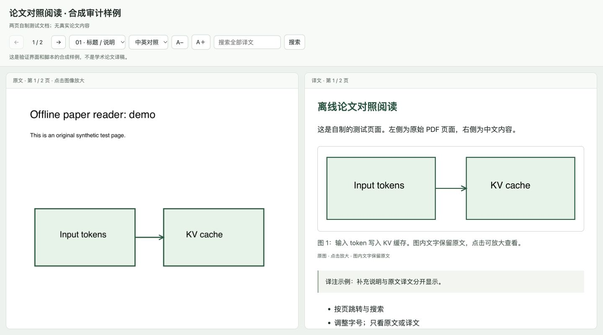

# Paper Translate Reader

把论文翻译成中文，保留原文和原图，放在一起读。

<br clear="left" />

**简体中文** · [English](README.en.md)

一个面向 Codex 的论文阅读技能。提供 PDF 后，代理阅读全文、逐页翻译，再生成一个可以离线打开的 HTML 阅读器：左侧是原始 PDF 页面，右侧是对应中文和论文原图。

## 阅读效果

- **按页对照**：保留原文上下文，可切换中英对照、只看译文或只看原文。
- **原图随文显示**：完整裁取图表区域，保留图内文字，配上中文图注；点击放大查看细节。
- **方便查阅**：页码跳转、译文搜索与高亮、字号调整，适配窄窗口。
- **单文件交付**：页面、译文和图片都嵌入 HTML，生成后无需服务端或网络即可阅读。
- **可追溯**：记录来源 PDF 指纹和图框，检查页码、图片来源与文件路径。



*桌面双栏截图（1440 × 800），来自自制测试文档。可下载 [演示 HTML](examples/demo.html) 后在浏览器中打开；GitHub 文件页展示的是 HTML 源码。*

## 开始使用

### 环境要求

- 能读取本地文件、运行命令并查看图片的 Codex 环境。
- Python **3.9+**；仓库脚本只使用 Python 标准库。
- 已安装的 **Poppler**：`pdfinfo`、`pdftotext`、`pdftoppm`，并且可从 PATH 调用。
- 一个现代浏览器，用于打开生成的 HTML。

脚本不会自动安装依赖。翻译由当前对话模型完成，脚本本身不调用翻译 API，也不需要额外的 API key。生成的阅读器可以离线使用；模型翻译阶段是否联网，取决于使用的代理环境。

### 先试用，再安装

把本仓库下载到本地，在 Codex 中提供仓库路径与论文 PDF，并发送：

```text
请先阅读这个仓库的 SKILL.md，按其中的流程完整翻译我提供的论文。
生成按原文页码排列的中文对照阅读器，在中文区保留原图，
图内文字不翻译，图注翻译为中文。输出到新的目录。
```

若要加入长期使用的技能列表，可以让 Codex 的 `$skill-installer` 从本仓库的 GitHub 地址安装，说明 `SKILL.md` 位于仓库根目录。安装方式见 [官方技能文档](https://learn.chatgpt.com/docs/build-skills)。安装完成后可使用：

```text
使用 $paper-translate-reader 翻译这篇论文，生成带原图的中文对照阅读稿。
```

本仓库不包含自动安装脚本；阅读或运行转换脚本不会注册技能。

## 它怎样工作

1. **准备 PDF**：提取逐页文本，渲染页面，生成来源指纹与译文模板。
2. **阅读和翻译**：代理通读正文与附录，逐页填写译文，核对公式、数字、表格和跨页内容。
3. **保留原图**：代理查看页面并确定图框，脚本按坐标直接从 PDF 裁图；逐张检查边界后，放进对应页的中文区。
4. **构建阅读器**：校验输入，把页面和图像内嵌为一个 HTML 文件，再检查阅读效果。

图框由代理定位，脚本不自动识别图片，也不对图内文字做 OCR 或翻译。

<details>
<summary>脚本命令与数据格式</summary>

以下命令从仓库根目录执行；先创建输出父目录，并把示例路径换成实际路径。

```sh
mkdir -p /absolute/task-output

python3 scripts/prepare_pdf.py \
  --pdf /absolute/paper.pdf \
  --out /absolute/task-output/source
```

读取生成的页面与文本，将 `source/translation.template.json` 复制为 `translation.json`，由代理填完每页译文。按 [图像流程](references/figures.md) 准备 `regions.json` 后裁图：

```sh
python3 scripts/crop_figures.py \
  --pdf /absolute/paper.pdf \
  --manifest /absolute/task-output/source/manifest.json \
  --regions /absolute/task-output/regions.json \
  --out /absolute/task-output/source/figures \
  --dpi 240
```

把生成的 `figure-blocks.json` 中各图块插入对应页的译文，再构建：

```sh
python3 scripts/build_reader.py \
  --manifest /absolute/task-output/source/manifest.json \
  --translation /absolute/task-output/translation.json \
  --out /absolute/task-output/paper-reader.html
```

完整格式见 [译文数据契约](references/translation-format.md)。脚本拒绝覆盖已有输出；修订时使用新目录或文件名。

</details>

## 翻译范围与限制

默认覆盖摘要、正文、图注、表格、脚注和附录。参考文献翻译标题，完整著录保留在原文页面；可以按需求调整范围。译注单独标识。

公式使用可读的 Unicode / 纯文本表达，精确排版可对照原文；不内置 LaTeX 渲染器。扫描件可能需要额外 OCR，本仓库不提供 OCR 引擎。高分辨率图片会增加 HTML 文件大小。

结构检查无法证明译文准确或没有遗漏；关键结论、公式、实验数字以及每张图的裁切边界仍需核对。文件读写与数据处理边界见 [数据处理说明](docs/data-handling.md)。

## 仓库结构

```text
.
├── SKILL.md                  # 代理执行的技能入口
├── agents/                   # Codex 展示元数据
├── scripts/                  # 提取、裁图、构建及共用校验
├── assets/reader.html        # 阅读器模板
├── references/               # 译文格式与裁图流程
├── tests/                    # 行为测试和自制 PDF 样例生成器
├── examples/demo.html        # 不含真实论文的离线演示
├── docs/                     # 数据处理说明、logo 和演示截图
├── README.md                 # 中文说明
├── README.en.md              # English documentation
└── LICENSE
```

## 验证

在满足 Poppler 依赖的环境中运行：

```sh
PYTHONDONTWRITEBYTECODE=1 python3 tests/test_reader.py
```

当前包含 15 项行为测试，覆盖 PDF 提取、原图裁切、HTML 内嵌、输入校验、路径边界和禁止覆盖。缺少 Poppler 时测试会跳过，不能将跳过视为转换功能验证通过。测试使用自制双页 PDF，不依赖外部论文。

## 许可证

代码和文档采用 [MIT License](LICENSE)。Logo 图像不包含在代码的 MIT 授权范围内；输入论文、原图和生成译文的权利也不由本项目许可证授予。
